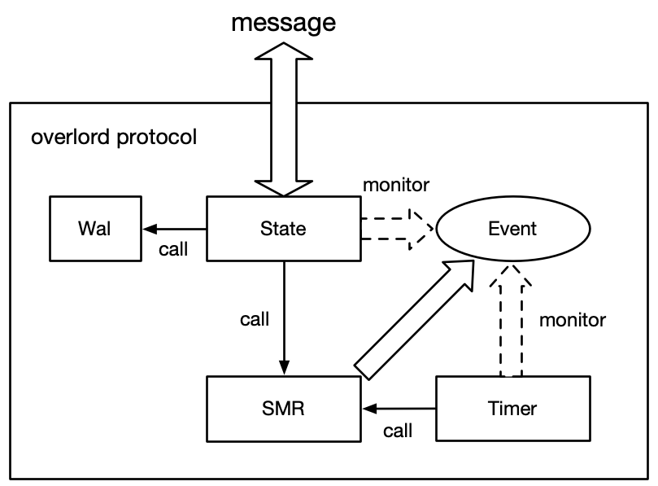
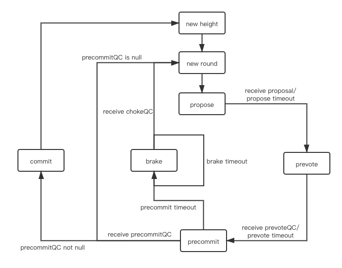

# 一、优化
我们对 Tendermint 主要做了三点改进：

- 将聚合签名应用到 Tendermint 中, 使共识的消息复杂度从 O(n^{2}) 降到 O(n), 从而能够支持更多的共识节点
- 在 proposal 中增加了 propose 交易区, 使新交易的同步与共识过程可并行
- 共识节点收到 proposal 后, 无需等 block 校验通过即可投 prevote 票, 而在投 precommit 票之前必须得到 block 校验结果, 从而使得区块校验与 prevote 投票过程并行

# 二、流程
基于tendermint，基本流程如下

## propose
leader: 接收客户端交易，打包交易形成proposal，广播proposal

follower：接收leader的proposal，验证，回复preVote投票给leader

## preVote

leader: 收集preVote投票，聚合2/3形成preVoteQC，广播

follower：接收leader的preVoteQC，验证，回复preCommit投票

## preCommit

leader: 收集preCommit投票，聚合2/3形成preCommitQC，广播

follower：接收leader的preCommitQC，验证

只要形成了非空的合法preCommitQC，就可以保证本次proposal将被所有好节点提交。

# 三、架构
Overlord 共识由以下几个组件组成的：

状态机(SMR)：根据输入消息的进行状态转换

状态存储(State)：用于存储提议，投票等状态

定时器(Timer)：设定超时时间触发状态机操作

Wal：用于读写 Wal 日志

如图所示

follower（从节点）节点状态转换

# 四、日志
## info
>[2022-07-07T06:27:23.443895747+00:00 INFO overlord::state::process] Overlord: state goto new height 62  
[2022-07-07T06:27:23.444147060+00:00 INFO overlord::state::process] Overlord: state goto new round 0  
[2022-07-07T06:27:23.445066822+00:00 INFO overlord::state::process] Overlord: "02b77c74eb68af3d4d6cc7884ed6709f1a2a1af0f713382a4438ec2ea3a70d4d7f" become leader, height 62, round 0  
[2022-07-07T06:27:23.462564061+00:00 INFO overlord::state::process] Overlord: achieve consensus in height 62, costs 1 round 18.510604ms time  
[2022-07-07T06:27:23.462585964+00:00 INFO overlord::state::process] Overlord: state goto new height 63  
[2022-07-07T06:27:23.462714979+00:00 INFO overlord::state::process] Overlord: state goto new round 0  

整个共识过程还是比较直观的，共识高度H的块，先从轮次0开始，
H+R就可以确定本高度、本轮次的leader了，那么各个节点的职责也就确定了。
H高度共识成功后，即进入H+1的共识。

## debug
log 分析，可以清晰的和架构图各个部分以及状态转换图对应起来。  
### follower(replica)
查看链接
https://www.notion.so/cryptape/overlord-7fc8dcf082484c2dbc8c9dafa22c25e7
### leader
查看链接
https://www.notion.so/cryptape/overlord-7fc8dcf082484c2dbc8c9dafa22c25e7