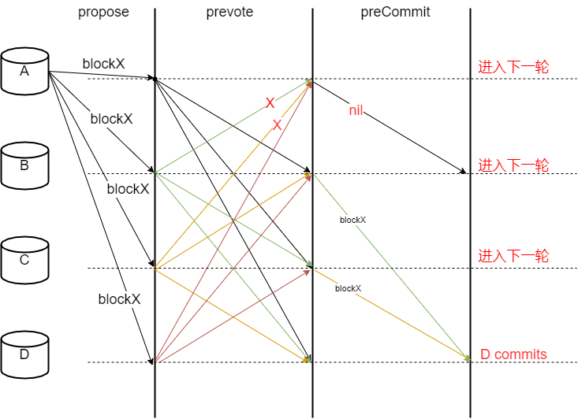
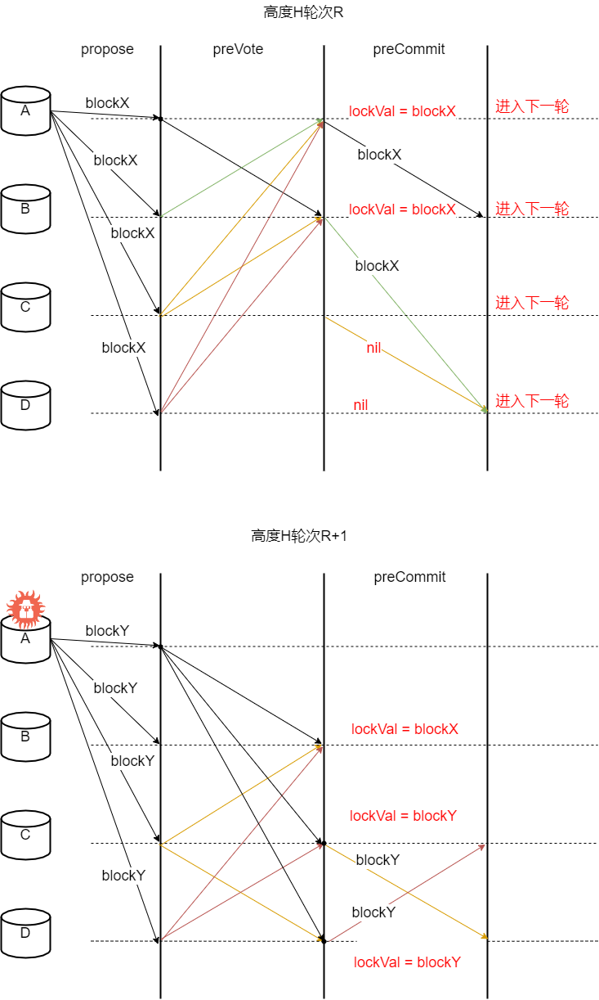
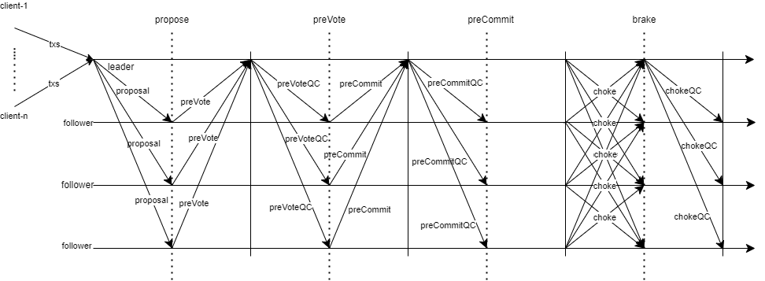

# 一、介绍
分布式系统指什么？很多台机器，位于不同地点，属于不同实体。。。
典型的分布式系统，举些例子：
比特币、以太坊这类区块链系统；分布式数据库，大数据等（etcd、zookeeper、hadoop、gfs...）；互联网？。 
但是呢，又希望可以形成合力，来更好（更快、更安全、更稳定...）的做事情。
那共识解决什么问题？顾名思义，就是让机器们对某些事情达成统一意见。更细节的，就是一套协议，可以协调这些机器们，让它们按照人的意志协作，不要各自为战，一团乱麻。
举个例子：
比如历史，日本人的侵华历史描述与中国人的；台湾的中国历史描述与大陆的，双方之间是有显然的差异的，原因在于什么？双方没有真正达成共识！结果是啥，争吵不断，冲突不止。。。
九二共识，就是双方达成了统一意见，至少曾经达成过，现在貌似。。。

这还只是两个参与方，涉及到多个、甚至几百几万后，想想就可怕。
我们主要讨论的是如何保证多方数据的一致性，学术上也称作SMR（state machine replication）。
所有的机器有相同的初始状态，然后均已相同的顺序执行请求（交易），这样就能保证机器之间状态同步（consistency的问题先不讨论）。
传统系统的局限：节点数量太少，几个；不考虑恶意节点，比如Chubby等数据中心使用的共识算法；节点往往直连，互相知晓。  

区块链系统：节点多，几百、几千以至更多；公链无许可加入，恶意攻击很正常；节点无法直连，只能通过谣言传播信息。
Tendermint为了解决区块链的特殊需求，应运而生。

# 二、概念

https://learnblockchain.cn/docs/tendermint/introduction/what-is-tendermint.html  
官网的是比较简单的介绍，可以先看看。

## 轮次 round
共识区分为不同高度、不同轮次，每个高度的共识只能有唯一的决定（块），为了达成某一高度的共识，可能需要多次通信，用轮次来划分整个共识的通信过程。
总结来说，每个高度必须成功共识，然后高度+1。一个高度的共识可能需要多轮才能完成，同一高度的轮次从0开始，如果某轮无法达成共识，那么进入下一轮（轮次+1）。
每轮会新选择一个leader（proposer），负责确定本轮打包的交易（广播块；收集投票vote是overlord的优化）。  
不同于pbft（封建王朝的终身制）仅当前leader不工作才切换leader，tendermint每轮结束后，进入新的轮次，都会切换leader（现代民主的定期选举制，提高安全性）。

高度+轮次，一定程度可以看作是逻辑时钟，logical clock，判断消息的新旧，从而作出正确决定。
主要贡献: 新的结束机制，不同于pbft，正常的共识流程和切换leader（proposer）的流程相同，切换leader已经融入到正常流程中了。
不同的轮次，所有的节点可以计算出相同的leader。成为leader的概率与投票权成正比，可以根据需要设置上下限？
每轮都有超时机制，保证系统可以前进。当然，随着连续失败次数的增加，超时间隔理应不断增加。（时钟漂移，网络等等）

／／　不恰当的类比：每个块相当于一个任期，任期开启前，需要选举，像有的国家，可能需要几轮选举（比如法国，首轮无人大部分票则要二轮）。
##　消息类型
- PROPOSAL
- PREVOTE
- PRECOMMIT

Value id，降低通信量，仅在PROPOSAL阶段
因为每轮的leader不同，所以不需要额外的leader选举阶段，而这个阶段正是pbft复杂度高的地方。

lock与hotstuff的lock类似，其实只是在当前轮次lock，整个共识流程并没有。叫polka更合适？然后POLC是proof of lock change的缩写。

# 流程
协议的参与者称为validators（验证者）；他们轮流提出区块并对其进行投票。 在链中提交的每一个区块都有一个height（高度）。 当一个区块提交失败时，协议将进入到下一round（轮），新的验证者将为该高度提出一个新的区块。 成功提交一个块需要两个阶段的投票，分别是pre-vote（预投票）和pre-commit（预提交）。 当超过2/3的验证者在同一轮中预提交同一个区块时，区块就会被提交到区块链中。

图中一对夫妇在跳波尔卡舞，因为验证者做的工作就像跳波尔卡舞。 当超过三分之二的验证者对同一个区块进行了pre-vote（预投票），我们称之为polka（波尔卡）。 每一个**pre-commit**（预提交）都必须由同一轮的波尔卡来证明。

那这样就没问题了吗？
## 锁定机制
如下场景

A，B，C，D四个节点，在高度H，轮次R共识区块blockX。
假定A、B、C、D均发出preVote，但是，因为网络原因，A没有收到足够的preVote，超时后透出nil的preCommit。
B、C、D都投出了blockX的preCommit。由于网络原因，B、C没有收到足够preCommit，D收到了足够preCommit并决定提交blockX。
而后，A、B、C均会进入高度H的下一轮R + 1，并且，3个节点足够形成共识，假定它们在高度H轮次R+1提交了blockY，那安全性就不满足了。
因此，必须要有一个锁定机制，当某个节点commit blockX之后，必须保证其它好节点也提交blockX。

当某个发出blockX的preCommit后，意味着可能有其它节点提交，所以当前需要暂时锁定在blockX，即lockedValue = blockX, lockedRound = R。

## 解锁机制
锁定是否就解决所有问题呢？确实能够达到safety，但是活性没有了。

假定A、B收到足够preVote，并发出preCommit，那么它们就锁定在了lockVal = blockX。但是C、D由于网络没有收到，从而进入下一轮R+1。
但是，A是作恶节点且在R+1为proposer，那么就可以提议blockY，且可以促成C、D收到足够blockY的preVote，从而锁定在blockY。这样，好节点中，B锁定于blockX，C、D锁定于blockY，系统死锁，丧失活性。
因此，对于B而言，如果收到了新的polka，那么需要替换其lockVal为blockY。
但这个解锁显然不过，A完全可以不发送blockY的preVote给B，导致B无法形成blockY的polka。必须有更完善的机制。

## 官方解释
验证者一定为锁定到的区块预投票
只有在之后轮次中出现针对那个区块的波尔卡，它才可以解锁并预通过新区块？=》死锁？

## overlord

为了防止失活的出现，增加了choke阶段？？