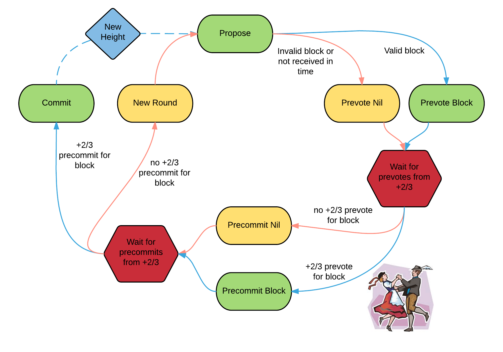

# 一、什么是Tendermint?
Tenermint是一个可以在多机器上安全一致地复制应用的软件。  

- **安全**是指多达1/3的机器无论出现何种类型的故障，Tendermint都可以正常工作。   
- **一致**是指每个正确运行的机器都可以获取完全相同的交易日志并计算得到相同的状态。 

在分布式系统中，安全一致地复制至关重要；从货币到选举再到基础设施管理等需要容错能力的应用中，它都有着重要作用。

**拜占庭容错**（BFT）指的是系统能够容忍机器以任意方式出现故障，包括机器故意危害系统的方式。 拜占庭容错理论已有几十年的历史，但最近由于比特币和以太坊等**区块链技术**的成功，其软件实现才逐渐流行。 区块链技术是在更现代的环境下对BFT的一种改造，重点引入了点对点网络和密码认证等技术。 区块链的名称来源于交易的处理方式，交易被打包在每一个区块中，每一个区块存储前一个区块的哈希值，形成了一个链式结构。 实际上，区块链数据结构优化了BFT设计。

这是整个项目的架构，对理解axon有一些帮助，可以根据自己兴趣细看，也可以和后续内容对照阅读。

# 二、Tendermint 和其他技术对比
Tendermint大体上类似于两类软件。  
- 第一类是非BFT一致性的分布式键值存储系统，包括Zookeeper、etcd和consul。  
- 第二类是“区块链技术”，包括比特币、以太坊等加密货币和Hyperledger Burrow等分布式账本。

## 1. Zookeeper, etcd, consul
Zookeeper、etcd和consul都基于经典非拜占庭容错一致性算法，实现了分布式键值存储。 Zookeeper使用了Zookeeper Atomic Broadcast版本的的Paxos共识算法，而etcd和consul使用了更新更简单的Raft共识算法。 一个典型的集群包含3-5台机器，并且可以容忍多达1/2机器的故障，**但是只要出现一个拜占庭错误机器，系统就会崩溃**。

虽然这些软件都提供了各有特色的键值存储功能，但都关注为分布式系统提供基础服务，如动态配置、服务发现、锁定、领导人选举等。

Tendermint虽然在本质上和以上软件类似，但是具有两点关键不同：

- 它实现了拜占庭容错。虽然只能够容忍系统1/3节点的故障，但是可以容忍任意类型的，包括黑客和恶意攻击的错误。
- 它不像键值存储那样只指定一种特定的应用，而是侧重于任意状态机复制。因此从键值存储到加密货币，再到电子投票平台，开发人员可以构建适合他们的任意应用程序逻辑。

## 2. Bitcoin, Ethereum, etc.
Tendermint诞生于比特币、以太坊等传统加密货币之后，目标是提供比比特币的PoW算法更高效、更安全的共识算法。 在早期，Tendermint内置了一种简单的货币，为了参与共识，用户必须将货币**绑定**到一个保证金池子中， 如果他们行为不当，保证金可能会被销毁——这就是Tendermint称为PoS算法的原因。

从那时起，Tendermint已经发展成为一个通用的区块链共识引擎，可以承载任意的应用程序状态。 这表示它可以成为其他区块链系统共识引擎的即插即用替代品。 因此，当前的以太坊代码库，无论是Rust、Go还是Haskell，都可以作为一个ABCI应用程序运行在Tendermint共识引擎之上。 事实上，已经实现了以太坊。我们接下来准备对比特币、ZCash和其他各种确定性应用完成类似的开发实现。

目前，另外一个已实现的基于Tendermint的虚拟货币应用程序是Cosmos网络。

# 三、对确定性的解释
区块链交易的处理逻辑必须是确定性的(deterministic)。 否则，即使恶意节点少于1/3，Tendermint核心节点之间也不会达成共识。

以太坊上的Solidity是区块链应用程序的非常好的选择，因为它是一种完全确定性的编程语言。 但是，对于现有的流行语言如java、C++、Python或GO，开发人员也能够构建确定性应用程序。 游戏程序员和区块链开发人员在构建确定性程序的过程中，已经了解如何避免一些非确定性情况，如：

- 随机数生成器（不使用确定性种子）
- 多线程之间竞争条件（或完全不使用多线程）
- 系统时间
- 未初始化的内存空间（如C或C++这样的内存不安全编程语言）
- 浮点运算，不同机器的浮点表示可能不同，可能产生不同结果
- 一些会产生随机性的语言特性（如go的map迭代）

虽然程序员可以通过谨慎开发来防止产生随机的结果，但是也可以为每种语言创建一个特殊的linter或静态分析器来检查确定性。 日后，我们可能会与合作伙伴一起开发这样的工具。

# 四、共识概述
Tendermint是一个易于理解的、主要是异步操作的BFT共识协议。协议遵循一个简单的状态机，如下所示：

协议的参与者称为validators（验证者）；他们轮流提出区块并对其进行投票。 在链中提交的每一个区块都有一个height（高度）。 当一个区块提交失败时，协议将进入到下一round（轮），新的验证者将为该高度提出一个新的区块。 成功提交一个块需要两个阶段的投票，分别是pre-vote（预投票）和pre-commit（预提交）。 当超过2/3的验证者在同一轮中预提交同一个区块时，区块就会被提交到区块链中。

图中一对夫妇在跳波尔卡舞，因为验证者做的工作就像跳波尔卡舞。 当超过三分之二的验证者对同一个区块进行了pre-vote（预投票），我们称之为polka（波尔卡）。 每一个**pre-commit**（预提交）都必须由同一轮的波尔卡来证明。

验证者可能由于多种原因未能提交区块： 当前的区块提交者可能离线，或者网络可能拥堵。 Tendermint允许他们确认应当跳过这个提交者。 在投票进入下一轮之前，验证者们会等待一小段时间从提交者处收到完整的区块。 由于依赖超时，Tendermint成为弱同步协议，而不是异步协议。 不过协议的其余部分是异步的，只有在收到超过三分之二验证者集合的消息后，验证者才会进行下一步工作。 Tendermint一个可以被简化的地方在于，和跳到下一轮投票一样，它使用了同样的机制进行提交区块处理。

只要拜占庭验证节点数目少于1/3，那么Tendermint保证永远不会违背安全性， 也就是说，验证者永远不会在同一高度提交冲突的区块。 为此，它引入了一些**locking**（锁定）规则，这些规则对流程图中的路径进行了模块化。 一旦验证者预提交一个块，它就锁定在该块上。那么，
- 验证者一定为锁定到的区块预投票
- 只有在之后轮次中出现针对那个区块的Polka波尔卡，它才可以解锁并预通过新区块

# 五、股权
在许多系统中，验证者在共识协议中可能具有不同的投票“权重”。 因此，Tendermint并不关注验证者数目的三分之一或三分之二， 而是关注总投票权的比例。此外，这个比例可能不是在各个验证者中均匀分布的。

更多可以参考
https://learnblockchain.cn/docs/tendermint/introduction/what-is-tendermint.html  
官网的是比较简单的介绍，可以先看看。

# 六、分析
解释
## 1. 锁定机制
如下场景

A，B，C，D四个节点，在高度H，轮次R共识区块blockX。
假定A、B、C、D均发出preVote，但是，因为网络原因，A没有收到足够的preVote，超时后透出nil的preCommit。
B、C、D都投出了blockX的preCommit。由于网络原因，B、C没有收到足够preCommit，D收到了足够preCommit并决定提交blockX。
而后，A、B、C均会进入高度H的下一轮R + 1，并且，3个节点足够形成共识，假定它们在高度H、轮次R+1提交了blockY，那安全性就不满足了。
因此，必须要有一个锁定机制，当某个节点commit blockX之后，必须保证其它好节点也提交blockX。  

解决方法：  
当某个节点发出blockX的preCommit vote后，意味着可能有其它节点提交blockX，所以需要将当前节点暂时锁定在blockX，即lockedValue = blockX, lockedRound = R。
然后，如果后续共识的区块与锁定冲突，则投Nil。
## 2. 解锁机制
锁定是否就解决所有问题呢？确实能够达到safety，但是活性没有了。

假定A、B收到足够preVote，并发出preCommit，那么它们就锁定在了lockVal = blockX。但是C、D由于网络没有收到，从而进入下一轮R+1。
但是，A是作恶节点且在R+1为proposer，那么就可以提议blockY，且可以促成C、D收到足够blockY的preVote，从而锁定在blockY。这样，好节点中，B锁定于blockX，C、D锁定于blockY，系统死锁，丧失活性。  
因此，对于B而言，如果收到了新的polka，那么需要替换其lockVal为blockY。
但这个解锁机制是否还是不够呢，A完全可以不发送blockY的preVote给B，导致B无法形成blockY的polka？